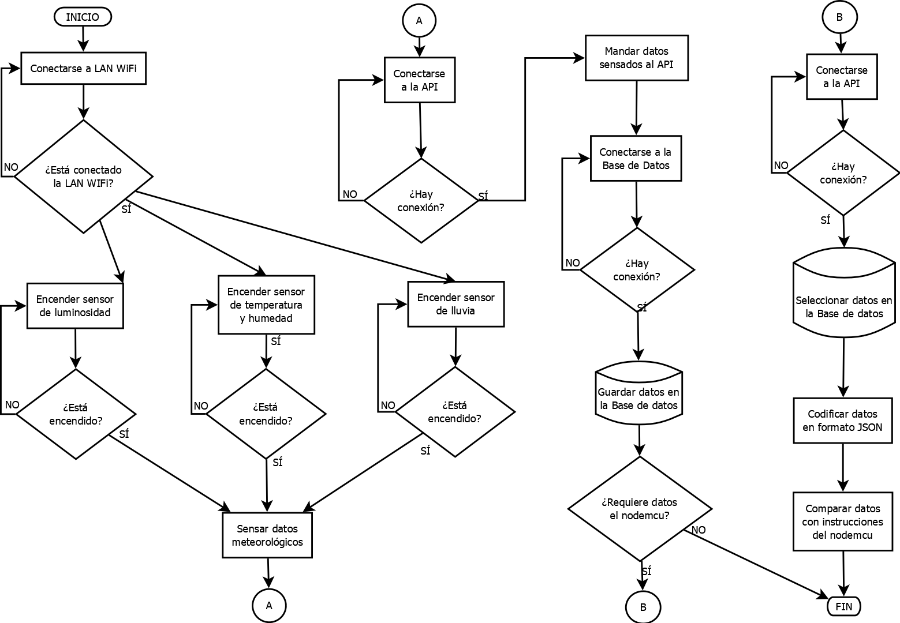

# Examen-Parcial-1-Big-Data-5B
### Novelo Espadas Esteban Andrés
### Pat Chim Marco Antonio
### Pérez Rodríguez Rosa Ivette

###
# HomeWeather
## Descripciones Generales
### El siguiente documento consta sobre la documentación del proyecto de IoT "HomeWeather" en el cual se redacta el propósito y funcionamiento de este.
### El kit "HomeWeather" proporciona un equipo sofisticado de automatización, a través de internet enviando datos recopilados de los sensores, que realiza acciones sin intervención del usuario, desde accionar ventanas, encender lámparas, ventiladores o cualquier equipo que el usuario desee.
### 
## Diagrama de flujo de informaciónm

###
## 5V's de Big Data   
### - Volumen
### Nuestro proyecto, al enviar los datos sensados de los dispositivos al servidor, el volumen se vuelve masivo porque los datos son recopilados y enviados en internet por medio del dispositivo NodeMCU ESP8266.
### - Velocidad
### Los datos almacenados de los sensores son procesados de manera rápida y devueltos al dispositivo NodeMCU para la toma de decisiones, que es el proceso principal de la automatización.
### - Valor
### El proyecto recopila datos sobre el estado del tiempo, temperatura, humedad, intensidad de luz, datos valiosos para el análisis y forma de trabajar del dispositivo final.
### - Veracidad
### Nuestra forma de comprobar la veracidad de nuestros datos es a través de la repetición constante de los datos, ya que los sensores envían información cada 20 segundos, de igual manera, el constante mantenimiento de los sensores y equipos ayuda a que los datos no fallen o puedan ser incorrectos.
### - Variedad
### Al momento de que el módulo NodeMCU recopila la información, dicha información se almacena de forma numérica, después del proceso de encapsulación, la manda en forma de texto e la base de datos alojada en el servidor, dicha información, cuando es presentada de forma gráfica puede ser descargada en formato de Excel para un mejor análisis.
###
## ETL
### Extracción de la información
### Los datos que serán recopilados en el proyecto, se obtienen de los diferentes sensados con respecto a los cambios meteorológicos, el sensor DTH-22 nos proporciona la información sobre el estado actual de la temperatura y la humedad del ambiente, el sensor ARD-355 mide la precipitación con una placa integrada, y el sensor GY-302 mide los valores de la intensidad lumínica, estos datos son enviados a la base de datos, a través de la página web administrativa se pueden realizar consultas con la API integrada a ésta.
### Transformación de la información
### Con los datos extraídos y analizados por medio la API, la información de la estación meteorológica manda la nueva información recopilada a los actuadores de los dispositivos, como lo podrían ser lámparas, motores para ventanas, etc.
### Carga de la información
### La información también puede ser representada por medio de gráficos, estos son llamados por sentencias incluidas en la programación PHP, además de contar con la prestación de las gráficas de Google Charts, ajustando los valores con respecto a nuestro proyecto, en los gráficos se muestra siempre en el eje de las X el tiempo transcurrido, mientras que en el eje de las Y los valores correspondientes de la temperatura, humedad y luminosidad, la precipitación es representada con un odómetro que indica el nivel de posible precipitación.
